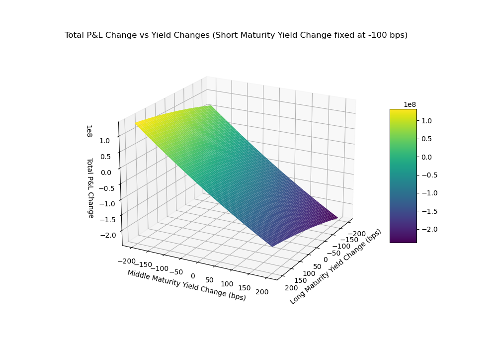

# Bond Portfolio Analysis Project

## Overview
This project focuses on analyzing a portfolio of US Treasury bonds, calculating key metrics, constructing various portfolios based on maturity, and visualizing portfolio performance under different yield scenarios. The project is modularized to enhance readability and maintainability, separating different functionalities into specific files and modules.

## Project Structure

- **main.py**: Main script that orchestrates data loading, bond categorization, calculation of key statistics, and portfolio analysis.
- **Modules**:
  - `bond_utils.py`: Functions for combining bonds into portfolios and categorizing bonds by maturity.
  - `portfolio_utils.py`: Functions for calculating position sizes and portfolio statistics, both for equal-value and equal-duration portfolios.
  - `visualization.py`: Function for plotting the P&L surface based on yield changes across different maturity portfolios.
  - `NonlinearSolver.py`: Custom nonlinear solver for calculating bond yield to maturity (YTM) through numerical methods.
- **Data**:
  - **us_treasury_data_20230905.csv**: Input file containing bond information (price, maturity, coupon payments).
  
## Key Components

1. **Bond Data Loading**:
   - Bonds are loaded from a CSV file and processed to create Bond objects with attributes such as ask price, coupon details, and remaining years to maturity.

2. **Portfolio Categorization**:
   - Bonds are categorized into four portfolios (A, B, C, D) based on remaining years to maturity:
     - Portfolio A: Long maturity (>15 years)
     - Portfolio B: Medium-long maturity (10-15 years)
     - Portfolio C: Medium-short maturity (7-10 years)
     - Portfolio D: Short maturity (2-7 years)

3. **Equal-Value and Equal-Duration Portfolios**:
   - **Equal-Value Portfolio**: Allocates a fixed value to each bond, computing metrics like yield to maturity (YTM), duration, modified duration, and convexity.
   - **Equal-Duration Portfolio**: Constructs portfolios with balanced duration exposure, useful for minimizing interest rate risk.

4. **Key Calculations**:
   - Calculations are performed for:
     - **Yield to Maturity (YTM)**: Solved numerically using a custom nonlinear solver.
     - **Duration & Modified Duration**: Measures bond sensitivity to interest rate changes.
     - **Convexity**: Quantifies the curvature of bond price sensitivity to yield changes.

5. **Butterfly Trade Simulation**:
   - A butterfly trade is simulated by setting positions in long, middle, and short maturity portfolios, adjusting for yield shifts. Scenarios are tested to observe the total portfolio profit or loss.

6. **PnL Surface Visualization**:
   - A 3D surface plot visualizes the portfolio's profit and loss under different yield change scenarios, highlighting potential risks and returns across different maturity exposures.

   

## Enhancements and Modularization

The project was modularized for clarity and flexibility:
- **Module-based Structure**: Separated functionalities across `bond_utils.py`, `portfolio_utils.py`, and `visualization.py`.
- **File Organization**: Consolidated all data and modules into organized folders, making the project easily extensible for additional analyses or data sources.

## Future Work
Potential future enhancements include:
- Extending portfolio construction strategies, such as adding yield curve-fitting techniques.
- Automating data updates for more real-time analysis.
- Enhancing visualizations to explore P&L sensitivity under various macroeconomic scenarios.